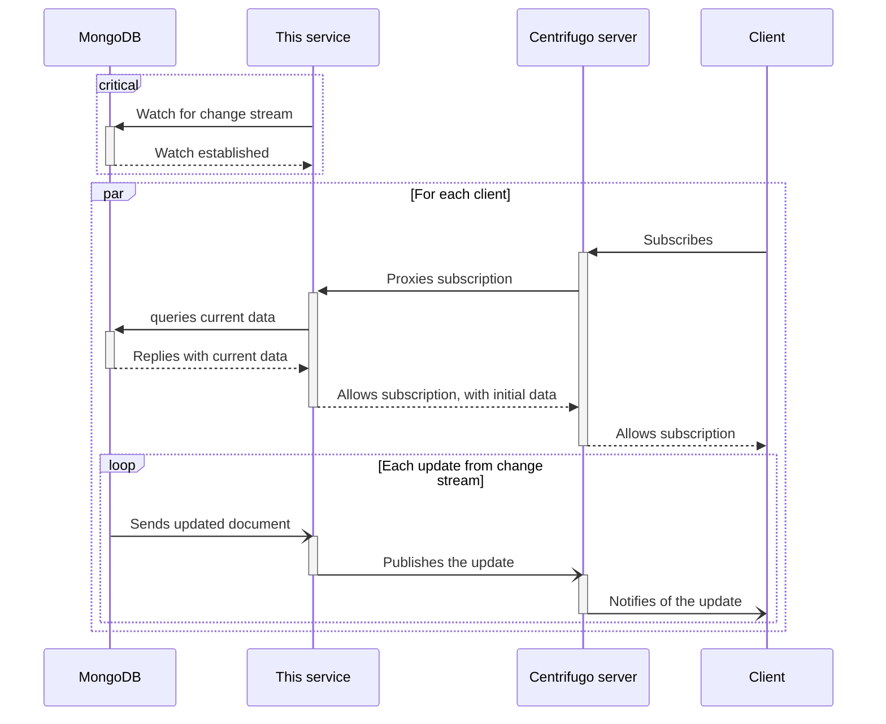

# centrifugo-change-stream

[](https://conventionalcommits.org)

Publish MongoDB changes and proxy subscriptions to Centrifugo.

## Specifications

### MongoDB

This service will establish a connection to MongoDB and watch a [change stream](https://www.mongodb.com/docs/manual/changeStreams/) on the configured database and collection.

It will also query MongoDB for data to send it to the client (as initial data) when a corresponding channel is subscribed.

### Centrifugo

Data from MongoDB change stream will be published to Centrifugo, on the channel with following characteristics:

- [namespace][centrifugo-namespace]: dot-separated MongoDB database and collection (complies with [MongoDB namespace][mongodb-namespace]);
- channel name: primary key of the document (`_id` field).

[centrifugo-namespace]: https://centrifugal.dev/docs/server/channels#channel-namespaces
[mongodb-namespace]: https://www.mongodb.com/docs/manual/reference/glossary/#std-term-namespace

This service will expose a Centrifugo subscribe proxy endpoint on `/centrifugo/subscribe`. For each subscription, it will send initial data in response `data` field.

To check the health of the connection with Centrifugo, this service will publish `null` data to `_` channel.

## Data flow



## Usage

```shellSession
$ centrifugo-change-stream --help
Usage: centrifugo-change-stream [OPTIONS] --centrifugo-api-key <CENTRIFUGO_API_KEY> --mongodb-database <MONGODB_DATABASE> --mongodb-collection <MONGODB_COLLECTION>

Options:
  -v, --verbose...
          More output per occurrence
  -q, --quiet...
          Less output per occurrence
      --listen-address <LISTEN_ADDRESS>
          Address to listen on [env: LISTEN_ADDRESS=] [default: 0.0.0.0:8080]
      --centrifugo-api-url <CENTRIFUGO_API_URL>
          Centrifugo server API URL [env: CENTRIFUGO_API_URL=] [default: http://centrifugo:8000/api]
      --centrifugo-api-key <CENTRIFUGO_API_KEY>
          Centrifugo API key [env: CENTRIFUGO_API_KEY=]
      --mongodb-uri <MONGODB_URI>
          URI of MongoDB server [env: MONGODB_URI=] [default: mongodb://mongo]
      --mongodb-database <MONGODB_DATABASE>
          MongoDB database [env: MONGODB_DATABASE=]
      --mongodb-collection <MONGODB_COLLECTION>
          MongoDB collection [env: MONGODB_COLLECTION=]
  -h, --help
          Print help information
```
